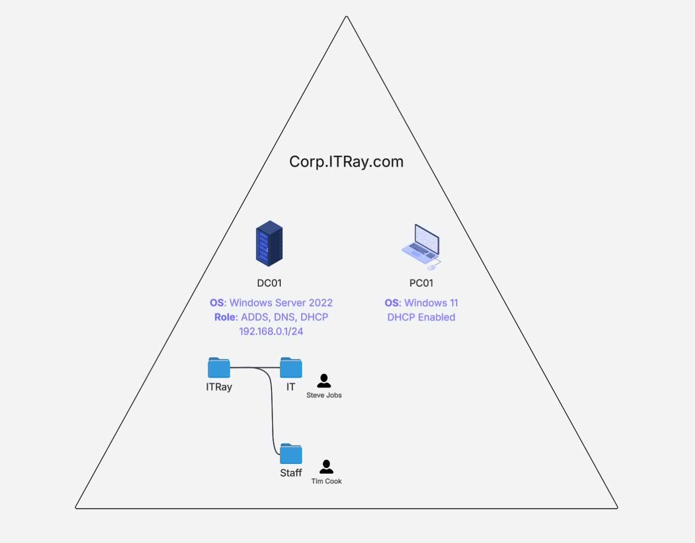

# Installing Active Directory Domain Services in Windows Server 2022, along with DNS and DHCP

## Overview
This project walks through the setup and configuration of a Windows Server 2022 machine as a primary domain controller with **Active Directory Domain Services (AD DS)**, **DNS**, and **DHCP**. The lab demonstrates infrastructure management using best practices such as static IP assignments and internal domain naming conventions.

---

## Objectives
- Configure Windows Server 2022 with a static IP
- Install and configure AD DS and DNS
- Promote the server to a Domain Controller
- Validate DNS setup and create reverse lookup zones
- Install and configure DHCP
- Join a Windows client to the domain
- Create Organizational Units (OUs) and users
- Troubleshoot network connectivity (e.g., firewall/ICMP settings)

---

## Domain Configuration
- **Domain Name:** `int.itray.com`
- **Domain Controller Hostname:** `DC01`
- **Static IP Address:** `192.168.0.1`
- **Default Gateway for Clients:** `192.168.0.254`

---

## Key Steps

### 1. AD DS & DNS Installation
- Server promoted to a domain controller using `int.itray.com`
- DNS installed alongside AD DS
- Validated Start of Authority and Name Server entries
- Created and verified **Reverse Lookup Zones**

### 2. DHCP Installation & Scope Configuration
- DHCP installed after AD to ensure domain authorization
- Scope configured: 
  - **Range:** `192.168.0.50 – 192.168.0.200`
  - **Gateway:** `192.168.0.254`
  - **DNS Server:** `192.168.0.1`

### 3. Client Setup (PC01)
- Network adapter set to automatic IP/DNS
- Verified domain connection
- Troubleshooted ICMP blocks in Windows Firewall to enable ping to DC01

### 4. Active Directory Users and Computers
- Created Organizational Units:
  - `IT` with user `Steve Jobs`
  - `Staff` with user `Tim Cook`
- Added `Steve Jobs` to domain admin group

---

## Tools Used
- Windows Server 2022
- Active Directory Domain Services
- DNS Manager
- DHCP Manager
- Windows 11 Client
- Windows Defender Firewall
- PowerShell, nslookup, ping, ipconfig

---

## Notes
- Firewall configuration is important to enable network diagnostics
- Reverse lookup zones are not created by default and must be added manually

---

## Author
Raymond Le  
📅 April 2025
